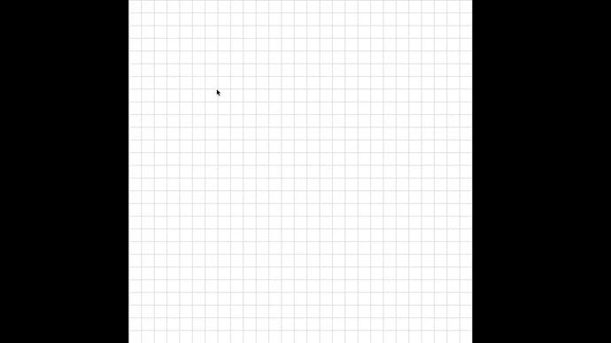
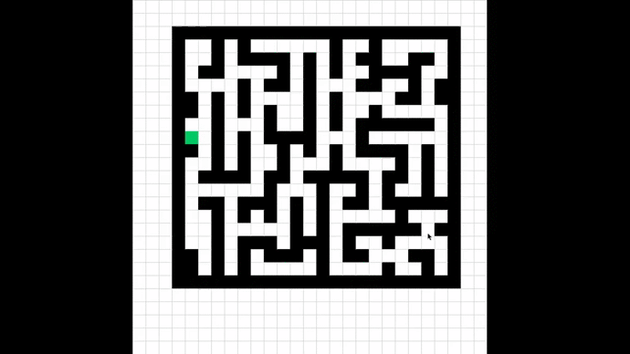
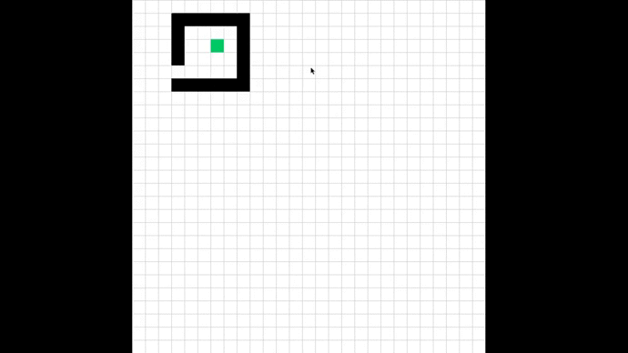

# Path Finder Algorithm Visualization
Visualization Source Code available for:

+ Dijkstra
+ A-Star

## Usage
Run `python main.py`
- Place mouse cursor over a cell and press `s` to set it source.
- Left click over any other cells to create obstacle and right click to remove obstacle.
- Place mouse cursor over another cell and press `d` to set it as destination, and the path finding should start automatically.

## Changing of Algorithm to search
Heading over to `settings.py` change `ALGORITHM` variable as per your need.
Set it `1` to use Dijkstra and `2` to use A-Star.

## DEMO

